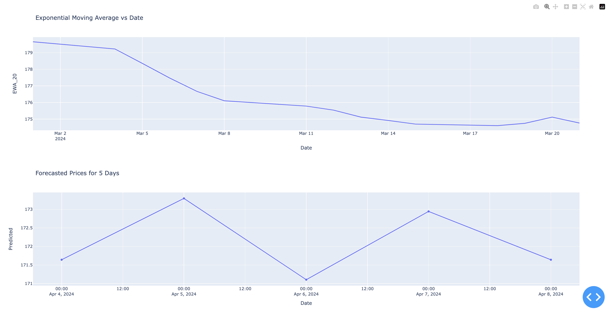

# Stock Predictor APP

# Add code and Inputs

# main notebook
[Link](https://www.kaggle.com/code/ekamsingh123go/stock-app/edit)
## Overview
Stock Predictor is a machine learning model designed to forecast stock prices using Support Vector Machines (SVM). This project aims to provide a tool for investors and traders to make informed decisions based on predicted stock prices.

## Features
- **SVM for Stock Price Prediction**: Support Vector Machines are utilized for their effectiveness in regression tasks, providing reliable predictions for stock prices.
- **Flask Backend**: The Flask backend enables easy deployment of the model, allowing users to interact with it through API endpoints.
- **Data Retrieval with Yahoo Finance**: Historical stock data is fetched from Yahoo Finance using the `yfinance` library, ensuring accurate and up-to-date information for analysis.
- **Preprocessing Techniques**: Data preprocessing is applied to optimize the input data, including feature engineering and scaling using Min-Max normalization.
- **Model Evaluation**: The performance of the model is evaluated using standard regression metrics such as Mean Squared Error (MSE) and Mean Absolute Error (MAE), providing insights into its accuracy.

## Usage
1. **Prepare Data**: Before training the model, ensure that you have historical stock data available. You can specify the ticker symbol and the forecast period to make predictions.

2. **Train and Test Model**: Use the provided functions to preprocess the data, train the SVM model, and evaluate its performance.

3. **Evaluate Model**: After training the model, evaluate its performance using the chosen metrics. Adjust parameters or preprocessing techniques as necessary to improve accuracy.

4. **Interact with Flask Backend**: Once the model is trained and evaluated, deploy it using the Flask backend. Users can make predictions by sending HTTP requests to the provided API endpoints.

